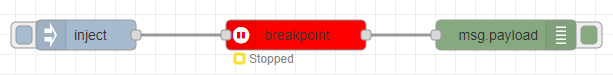

## How to use

Input the breakpoint node with some JSON message or other message. Set the timer for which you want to pause the execution of the flow. When you will inject some value, value will wait till the time you specified. You can find the status of the node, just below the node. 
When node is in Running status, if you click on the button "Explore with JSONata", your JSON data (msg.payload) will automatically loaded into <a href="https://jsonata.cgignite.io/" target="_blank">Ignite JSONata Explorer</a> and open in the new tab.
Once specified time will pass, flow will resume the execution and data will automatically wiped off.

### Example

<b>Flow JSON</b>
~~~json
[{"id":"8e5164.fdd2dea","type":"tab","label":"Flow 1","disabled":false,"info":""},{"id":"50ea74a6.f6408c","type":"inject","z":"8e5164.fdd2dea","name":"","props":[{"p":"payload"},{"p":"topic","vt":"str"}],"repeat":"","crontab":"","once":false,"onceDelay":0.1,"topic":"","payload":"{\"FName\":\"Dev\",\"LName\":\"Das\"}","payloadType":"json","x":150,"y":260,"wires":[["a0eb3ccf.94c8b"]]},{"id":"71ef2969.e12798","type":"debug","z":"8e5164.fdd2dea","name":"","active":true,"tosidebar":true,"console":false,"tostatus":false,"complete":"false","statusVal":"","statusType":"auto","x":570,"y":260,"wires":[]},{"id":"a0eb3ccf.94c8b","type":"breakpoint","z":"8e5164.fdd2dea","name":"","timeout":"3","x":360,"y":260,"wires":[["71ef2969.e12798"]]}]
~~~

