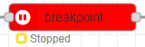
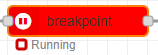
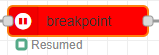
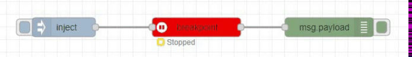
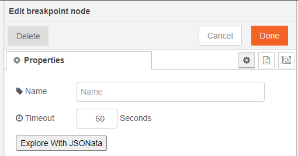

## Introduction

breakpoint allows you to pause the execution of the flow and help you to explore your JSON data (msg.payload) directly into the <a href="https://jsonata.cgignite.io/" target="_blank">Ignite JSONata Explorer</a>

## Running Status

breakpoint node, initially start with status Stopped.

When you initiate message withing this node, node changed to status Running.

One node will finish his timeout value and stopped running service, noded changed to status Resumed

## Properties

### Timeout

set the time for which you want to pause the execution of the flow and want to explore data into JSONata explorer. After the timeout period data will be automatically wipe out and node status will be Resumed.

### Explore With JSONata

When node will be in running status, data will be available in breakpoint node and when you will click on this button, data will be automatically loaded into JSONata explorer in another tab.

