## Deploy application in AWS Lightsail

### Create Instance

Visit: **<u><a href="https://lightsail.aws.amazon.com/ls/webapp/home/instances" target="_blank">https://lightsail.aws.amazon.com/ls/webapp/home/instances</a></u>**

Click on button **“Create instance”**.

### Select Platform

Select suitable platform for you among Linux/Unix and Windows.

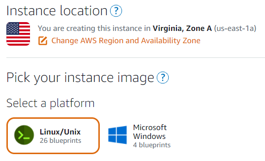

### Select a Blueprint

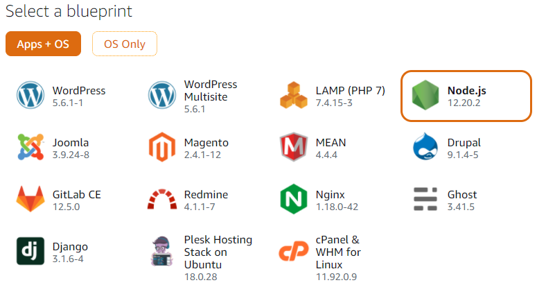

### Select Instance Plan

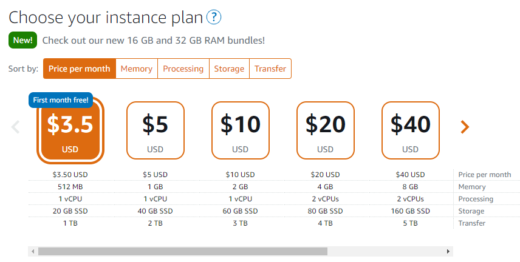

### Create Instance 

Provide suitable instance name.

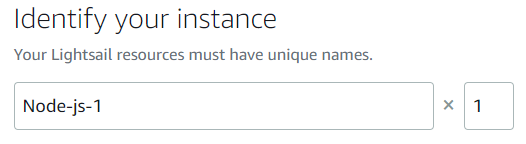

Click on button **"Create Instance"**.

Application will start processing...

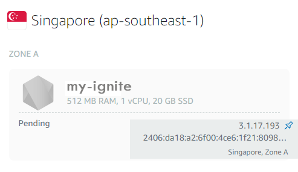

Once processing completed, application will start running.

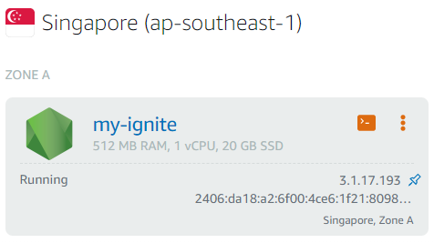

### Set Static IP

Click on Application instance name and select Networking tab and click on link button **“Create static IP”**.

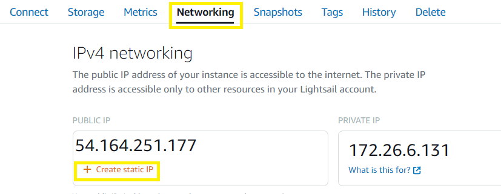

Select Application instance from **"Select an instance"** dropdown menu.

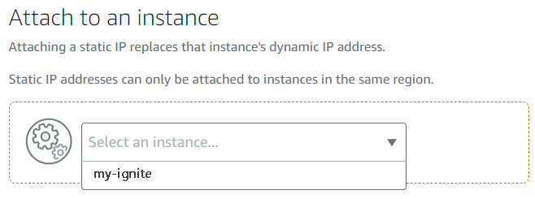

Provide any static IP identifier for your application.

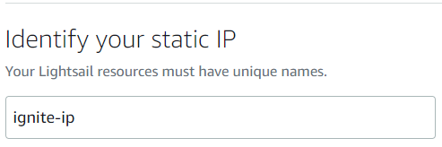

Click on button **“Create”**

After static Ip will create, this will look like below-

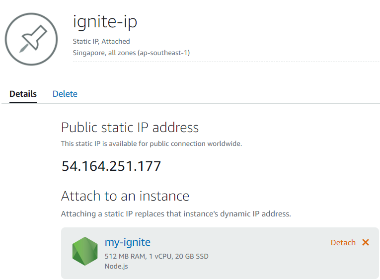

### Add Port Number

You can add port number from link button **“Add rule”** under **“Networking”** tab.

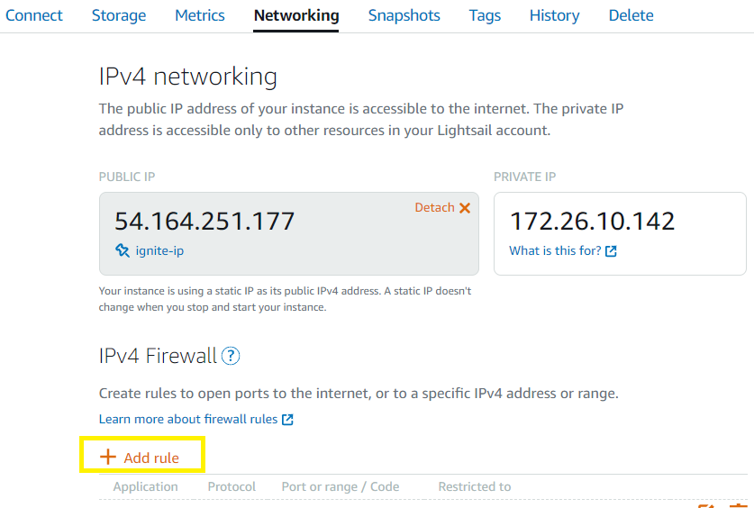

Provide port number.

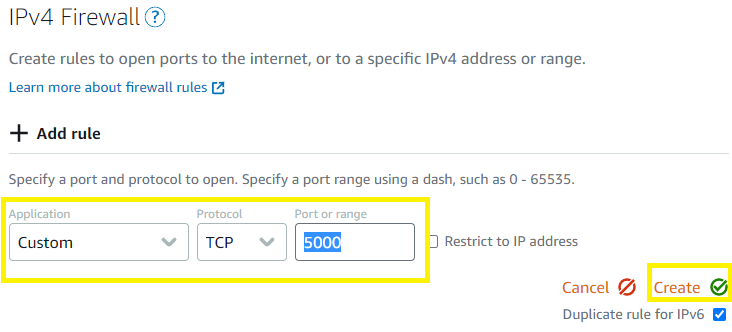

You can see the latest added rule.

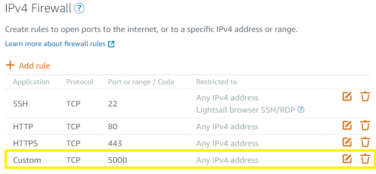

### Setup Instance

Select tab **“Instances”**, there you can see your newly added instance. Click on the console icon in the instance (Make sure instance is in Running status).

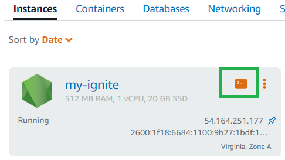

A console window will be open.

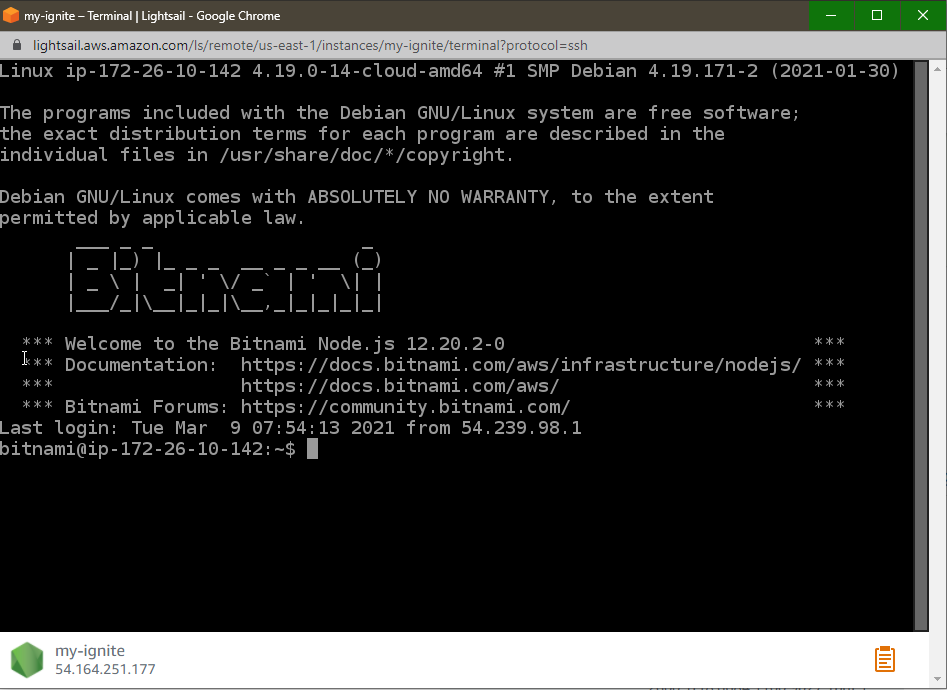

Run the following commands

    ls
    cd htdocs
    rm -rf *
    git clone urlForYourGitHubRepository
    Provide github UserName and Password
    cd yourApplicationDirectory
    ls
    npm install
    node yourJsFileName

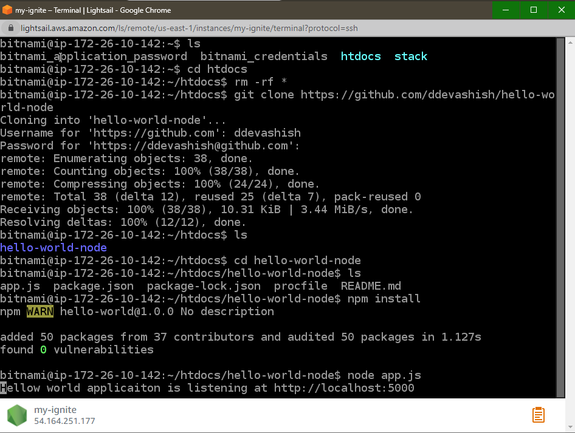

### Run Application on Browser

Now open the static IP in the browser, you will find that application will be running there.

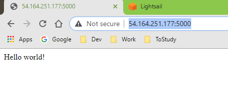

