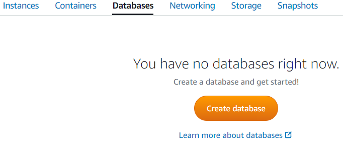
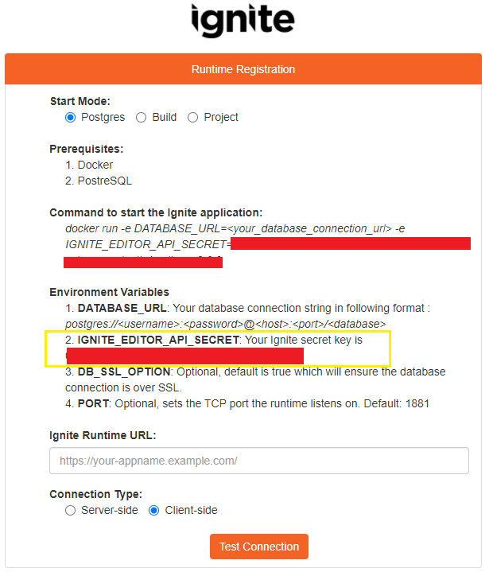

## Create Database in AWS Lightsail

### Initiate Database Creation

Visit: **<u><a href="https://lightsail.aws.amazon.com/ls/webapp/home/databases" target="_blank">https://lightsail.aws.amazon.com/ls/webapp/home/databases</a></u>**

Click on button **“Create database**.

### Select Database Location

### Select an Availability Zone

### Select Database

### Set Database Credential

Set your database username and password for further connecting to the database

### Set your master database name

Copy or save this **database name** for <u>**[Set up database url](#set-up-database-url-for-aws-container-creation)**</u>**

### Choose Database Plan

### Set Database Identify

### Create Database

Once database creation will finish you can see the database as below-

### Set Database Public Mode On

### Set up Database URL for AWS Container Creation

Select tab **“Connect”**, there you will get following details-

Endpoint (Host)

Database: Get from <u>**[Set your master database name](#set-your-master-database-name)**</u>

User name

Password

Port: Default 5432 for PostgreSQL

Now create your DATABASE_URL as below format by using above values

postgres://<username>:<password>@<host>:<port>/<database>

Copy or save this DATABASE_URL for <u>**[AWS Container Creation Process](#set-environment-variables)**</u>

## Create App and Get Ignite Keys in Cgignite Dashboard

### Create App

Visit: **<u><a href="https://dashboard.cgignite.io/apps" target="_blank">https://dashboard.cgignite.io/apps</a></u>**

Click on button **“New App”**

### Set App Name

Provide a suitable name for your application and click on button **“Create App”**

### Get Key for AWS Container Creation

You will get the IGNIT_EDITOR_API_SECRET key, copy or save this key for later use in <u>**[AWS container creation process](#set-environment-variables)**</u>.

### Set Ignite Runtime URL

We will setup this URL once we will finish the "<u>**[AWS container creation process](#set-cgignite-dashboard-app)**</u>".

## Create and Setup Container in AWS Lightsail

### Initiate Container Creation Process

Visit: **<u><a href="https://lightsail.aws.amazon.com/ls/webapp/home/containers" target="_blank">https://lightsail.aws.amazon.com/ls/webapp/home/containers</a></u>**

Click on button **“Create container service”**

### Select Container Service Location

### Select Service Capacity

Select container service capacity for memory utilization

### Set up Deployment

Click on link button **“Set up deployment”**

Select option **“Specify a customer deployment”** 

Container name: Provide your suitable container name
Image: Provide Ignite runtime image
cybergroupignite/runtime:v2.0.0

### Set Environment Variables

Click on link button **“Add environment variables”**

Set DATABASE_URL from step “<u>**[Set up Database URL for AWS Container Creation](#set-up-database-url-for-aws-container-creation)**</u>”

Set IGNITE_EDITOR_API_SECRET from step “<u>**[Get Key for AWS Container Creation](#get-key-for-aws-container-creation)**</u>”

Set DB_SSL_OPTION: true/false (Default: true)

Set PORT: Set Port Number (Default: 1881)

### Set Port

Click on link button **“Add open ports”**

Add port 80 with Protocol HTTP/HTTPS

### Set your public end point 

### Provide your container service identity

### Create container service

It takes couple of minutes to create the container server. Once successfully copy the public domain value.

### Set CgIgnite Dashboard App

Continue the step from “<u>**[Set Ignite Run Time URL](#set-ignite-runtime-url)**</u>” in CgIgnite Dashboard

Click on button **“Test Connection”**. You will get the newly created app in the dashboard.

### Launch App

Now click on right launch app button and you will get that your Ignite running application on browser.