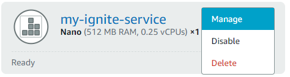
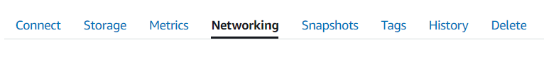

## Manage Application in AWS Lightsail

### Find all application list
 
To view all your Heroku application list, just go to Lightsail home page 

**<u><a href="https://lightsail.aws.amazon.com/ls/webapp/home/instances" target="_blank">https://lightsail.aws.amazon.com/ls/webapp/home/instances</a></u>**

Click on the three dots in the instance.

You will get different option to manage the application

Select option **“Manage”**, there you will get various other option to manage the application

