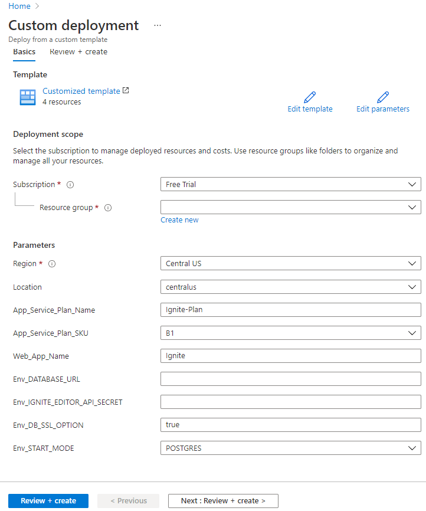

## Deploy application

After the Ignite Platform team provisions your account, you may use the following **"Deploy to Azure"** button to get started.

> *Note: You may need to sign up or login in azure for this.*

You will be redirect to custom deployment page, where you need to fill few fields for custom deployments

Below are required parameters details-

- **Subscription:** Select your azure account subscription type that you want for this custom deployment.
All resources in an Azure subscription are billed together.

- **Resource group:** A resource group is a collection of resources that share the same lifecycle, permissions, and policies. You can select your existing resource group or can also create new one.

- **Region:** Select a location for the resource group. For example, Central US. Not every resource is available in every region.

- **Location:** Select a location for the storage account. For example, Central US.

- **App_Service_Plan_Name:** Provide app service plan name

- **App_Service_Plan_SKU:** Select the suitable Azure plan. For more information about Azure plan visit <u><a href="https://azure.microsoft.com/en-us/pricing/details/app-service/linux/" target="_blank">Azure Pricing Plans</a></u>

- **Web_App_Name:** Create a unique and suitable web application name. Your deployed application will be running with your web app name. for example, if Web_App_name is "myDemo" then application will be hosted in URL 
    > **[https://myDemo.azurewebsites.net/](#)**

- **ENV_DATABASE_URL:** Ignite Application's Database URL

- **ENV_IGNITE_EDITOR_API_SECRET:** Ignite Application's API Secret key

- **ENV_DB_SSL_OPTION:** Ignite Application's Database SSL option (true/false)

### Observation 1: 
If someone else is using the same web app name then during deployment, you will get error like below-

### Observation 2: 
If there is any validation issue, you will get the status like below–

### Observation 3: 
Once deployment completed you will get message as below–

