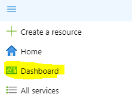
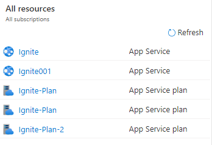
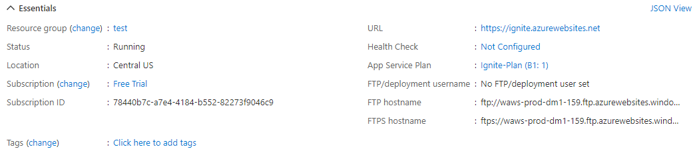
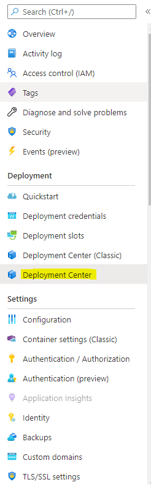
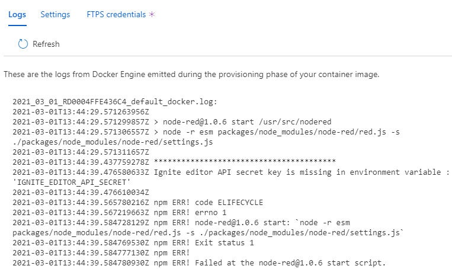
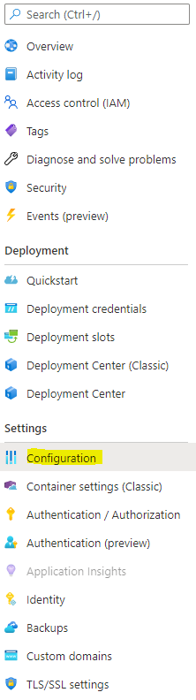
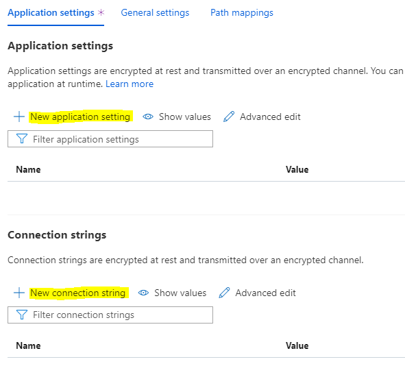

## Find all application list
 
To view all your azure application list, just go to Dashboard screen. You can find the option from below screen-

You will find the list of all you applications under section "All resources"

## Get details about the specific application

Click on any application from the application list, you will get details about the selected application

You can get different section with specific details about the application

- Stauts: Running/Stopped
- URL: Where you can found the deployed application.
- App Service Plan: Azure plan for the application
- Health Check: You can configure the helth check for the application at some application end point.

## Check log 

To check the log for your deployed application, click from left menu option "Deployment Center"

You will get the log information from the right pane under log menu.

## Configure application

To configure azure deployed app for ignite, click from left menu option "Configuration"

You can add application setting and connection string here-

You can add your application environment variable under application setting section.

