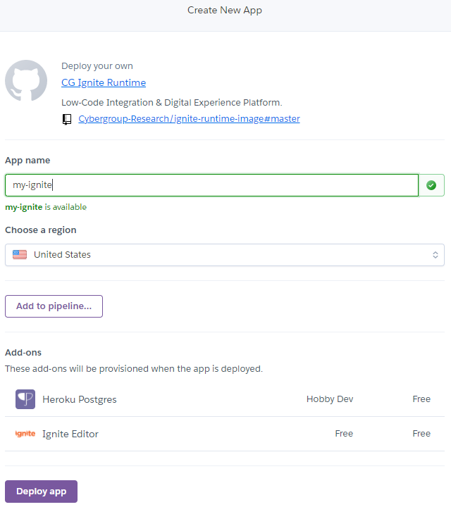
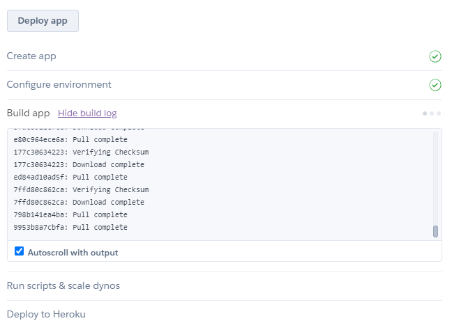
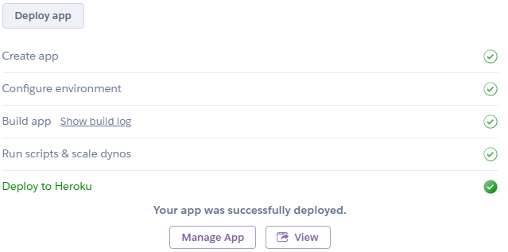

## Deploy application in Heroku

You may use the following **"Deploy to Heroku"** button to get started.

Provide suitable app name and click on button **“Deploy App”**

Heroku will take some time to deploy your **“Ignite Editor”**.

Once deployed successfully, you will get message for the same as below-

Click on button **“Manage App”**, and you will be redirected to the newly created app under Heroku