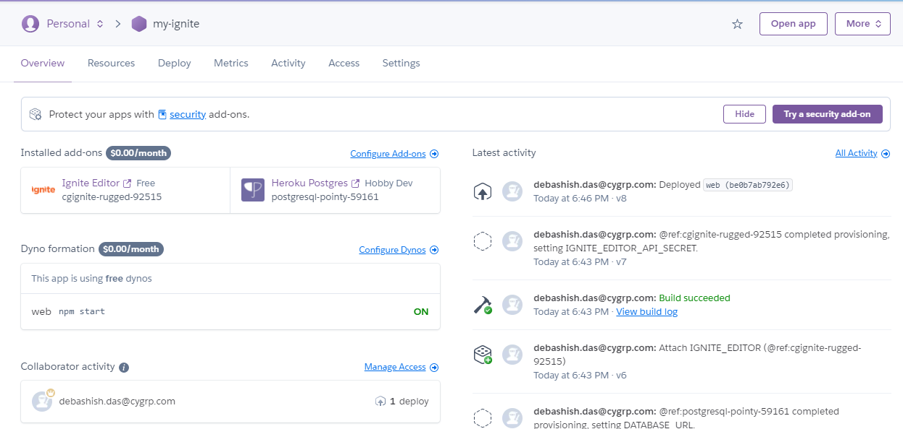
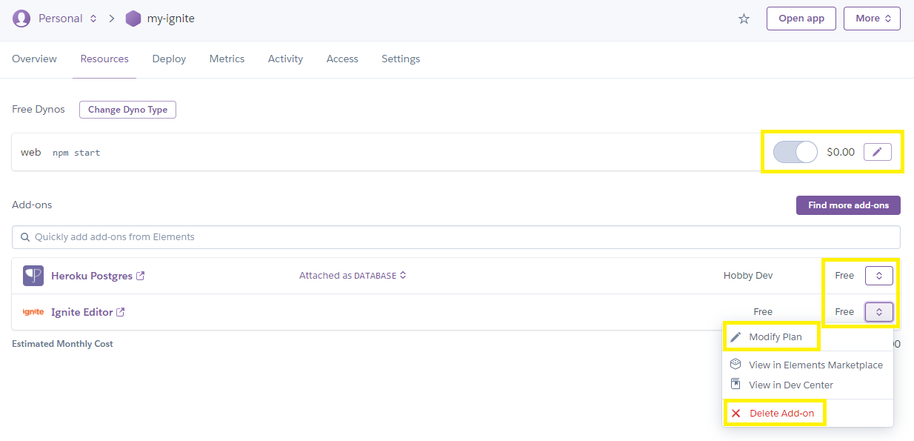
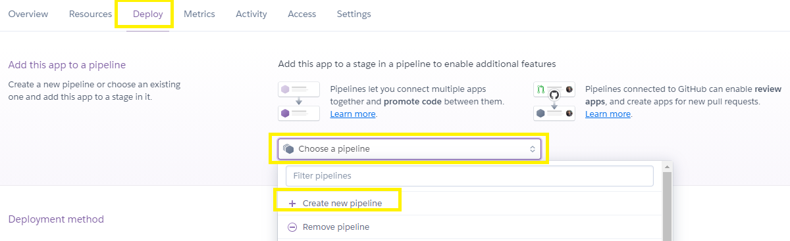
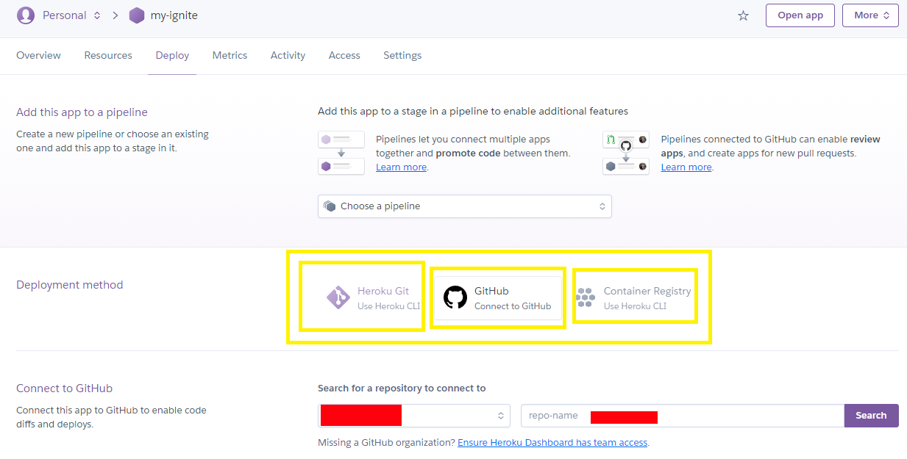
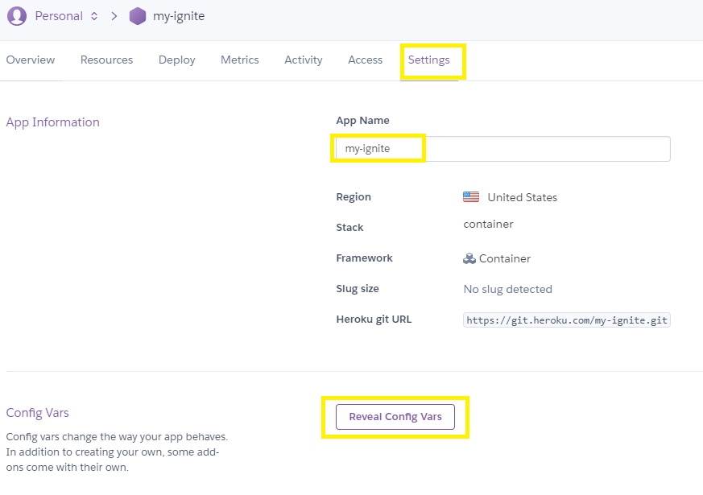

## Manage Application in Heroku

### Find all application list
 
To view all your Heroku application list, just go to Dashboard 

**<u><a href="https://dashboard.heroku.com/apps" target="_blank">https://dashboard.heroku.com/apps</a></u>**

You will find all the deployed application in Heroku. Click on your application from the list.

### Configure Add-ons

Click on the link “Configure Add-ons” for modify/delete the addon, change the plan

### Add/modify pipeline

Select Deploy tab, you will get option to add/modify pipeline for release

### Deploy using your repository

You can select, the suitable method for your deployment. GitHub is widely used for managing your deployment.

### Application Setting

By selecting Settings tab, you can modify/delete application. Also, you can see your **DATABASE_URL** and **IGNITE_EDITOR_API_SECRET** from button **“Reveal Config Vars”**.  

