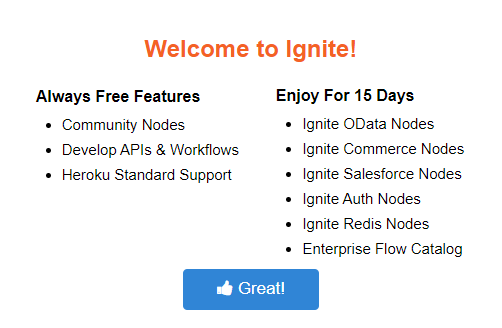

## Installation Steps

Ignite is "Heroku" based application, so user must be sign up with Heroku. Below are the steps for installing ignite-

### Step:1

Visit <a href="https://www.cgignite.com/" target="_blank">CgIgnite</a>

### Step:2

Click on <b>"Try Now On Heroku"</b>

### Step:3

Fill the <b>Registration</b> form and press submit button

You will be redirect to Heroku application. If not already register then you need to register in Heroku first. Then you will be redirected to the create new app page.

### Step:4

Provide any application name which will be available

### Step:5

Click button <b>"Deploy App"</b>

Deployment, can take few minutes

### Step:6

Once application deployed successfully, then click on button <b>"Manage App"</b>

### Step:7

You will be redirect to your newly created application. There you will find addon <b>Ignite Editor</b>. Click on that.

### Step:8

You will successfully installed Ignite editor, and you will get the welcome page

## Example

Here is the step by step installation process for ignite

