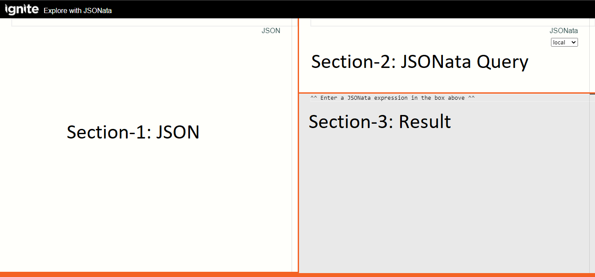
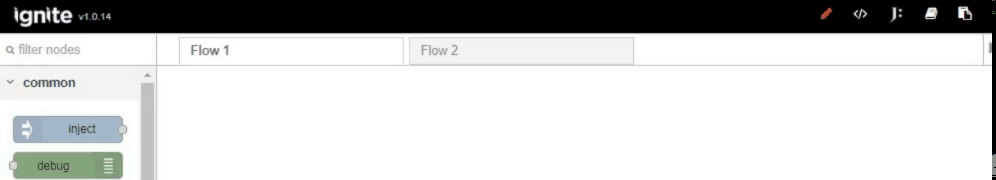
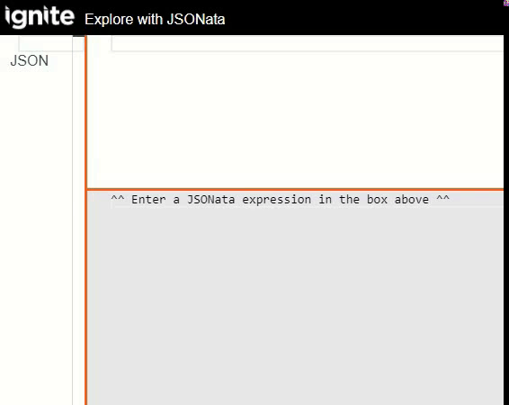
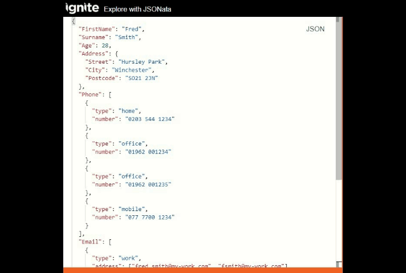
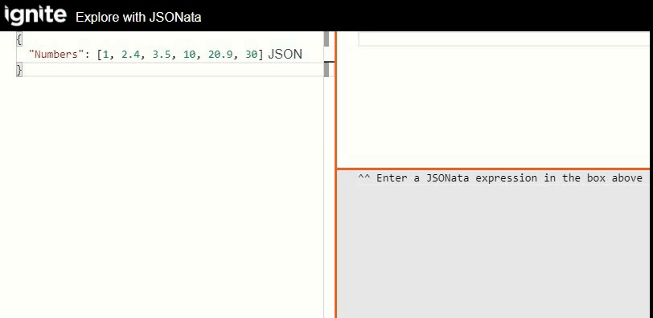

## What is JSONata

- Open-source lanuage for querying and transforming JSON.
- Extract specific meaningful data from it using a relatively simple logic.
- Sophisticated query expressions with minimal syntax
- Format query results into any JSON output structure
- Inspired by the location path semantics of XPath 3.1
- Create user-defined functions
- Imposes no limit on the complexity of your data transformation task.
- Any valid JSON data is also a valid JSONata expression.

Imagine you have an order with several items and you need to calculate an average price or a total price; or you have only maximum amount and you need to get minimum amount as a result of your integration.

With JSONata such data transformations become a matter of several minutes and you will be able to watch in real-time how your data transforms according to your conditions.

## What is JSONata Explorer

It is an Open-editor to explore you JSON. It has 3 sections as below image-

- <b>Section-1:</b> You can provide any JSON (simple/complex)

- <b>Section-2:</b> You can provide the JSONata query to fetch the customized JSON result.

- <b>Section-3:</b> You will get the customized result value.



## Redirect to JSONata Explorer from Ignite Editor

You can redirect to Ignite JSONata from editor



## How to use JSONata Explorer

- <b>Step-1:</b> Open <a href="https://jsonata.cgignite.io/" target="_blank">JSONata Explorer</a>

- <b>Step-2:</b> Copy below JSON and paste into section-1 inside JSONata Explorer

```sh
{
  "FirstName": "John",
  "Surname": "Russell",
  "Age": 28,
  "Address":
    {
        "Street": "Hursley Park",
        "City": "Winchester",
        "Postcode": "SO21 2JN"
    }
}
```

- <b>Step-3:</b> Now write down <b>FirstName</b> in the section-2 inside JSONata Explorer

- <b>Step-4:</b> You will get the result John in section-3 inside JSONata Explorer


## Example

Here are some example expressions and their results when applied to the JSON document:

- <b>Basic Query</b>


- <b>String Function</b>


- <b>Numeric Function</b>



- <b>String Expressions</b>



- <b>Numeric Expressions</b>



## Additional Resource

   [df1]: <https://docs.jsonata.org/overview>

For more information about JSONata detail please visist <a href="https://docs.jsonata.org/overview" target="_blank">here</a>