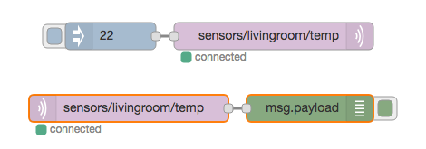

## Problem

You want to connect to an MQTT broker running locally.

## Solution

Use the <code class="node">MQTT Input</code> input or <code class="node">MQTT Output</code> node
and an associated <code class="node">MQTT Config</code> node to connect to an MQTT broker.

## Example

<b>Flow JSON</b>
~~~json
[{"id":"2c6873d2.992abc","type":"mqtt out","z":"eda2a949.74ea98","name":"","topic":"sensors/livingroom/temp","qos":"","retain":"","broker":"407a01e4.6b637","x":330,"y":80,"wires":[]},{"id":"d9beed59.94155","type":"inject","z":"eda2a949.74ea98","name":"","topic":"","payload":"22","payloadType":"num","repeat":"","crontab":"","once":false,"x":150,"y":80,"wires":[["2c6873d2.992abc"]]},{"id":"be80048.8f232f8","type":"mqtt in","z":"eda2a949.74ea98","name":"","topic":"sensors/livingroom/temp","qos":"2","broker":"407a01e4.6b637","x":170,"y":160,"wires":[["8640b8ff.f82ff8"]]},{"id":"8640b8ff.f82ff8","type":"debug","z":"eda2a949.74ea98","name":"","active":true,"console":"false","complete":"false","x":370,"y":160,"wires":[]},{"id":"407a01e4.6b637","type":"mqtt-broker","z":"","broker":"localhost","port":"1883","clientid":"","usetls":false,"compatmode":true,"keepalive":"60","cleansession":true,"willTopic":"","willQos":"0","willPayload":"","birthTopic":"","birthQos":"0","birthPayload":""}]
~~~

## Discussion

Many users will run an MQTT broker such as [mosquitto](http://mosquitto.org) on
<<<<<<< HEAD
the same Raspberry Pi or PC that Ignite Runtime is running on.  Once you have an
=======
the same Raspberry Pi or PC that Ignite is running on.  Once you have an
>>>>>>> 77962820abc7d85fa2438e8b53bf4fe454a050b9
<code class="node">MQTT</code> input or output node in your flow, you create an
<code class="node">MQTT Config</code> node by clicking on the `Server` configuration
 pop-up and selecting `Add an MQTT broker...`.  Assuming your broker is open,
 set the server host to `localhost` and leave the port set to `1883`.

To connect to non-local, secured brokers, other <code class="node">MQTT Config</code>
node options will need to be set according to your broker's connectivity requirements.
