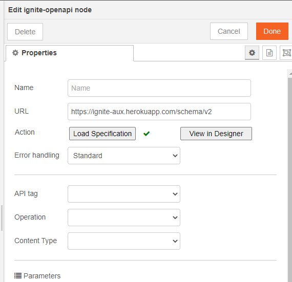

## About

This node, is used to load and hit openAPI end point

## Usage

Enter the URL to your openAPI configuration (json or yaml file) and push the <b>Read</b> button. That's it. You can now select the operation you want to run.

### Example

<b>Flow JSON</b>
~~~json
[{"id":"8bbf076d.854308","type":"ignite-openapi","z":"fc80d035.d7951","name":"","openApiUrl":"https://ignite-aux.herokuapp.com/schema/v2","api":"pet","operation":"findPetsByStatus","operationData":{"name":"Finds Pets by status"},"errorHandling":"","parameters":{"query status":{"name":"status","in":"query","required":true,"value":"available","isActive":true,"inputType":{}}},"contentType":"application/json","outputs":1,"x":460,"y":880,"wires":[["9b986a29.be9858"]]}]
~~~

