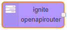

## About

ignite openAPI allows to work with APIs defined by OpenAPI 3 (Swagger). You can set parameters within the Node-RED-UI and trigger the flow from within your flow.

It is based on <a href="https://github.com/swagger-api/swagger-js" target="_blank">swagger-js</a>

## Nodes

ignite openAPI contains two nodes

### [OpenAPI Router](./openAPI-router.md "OpenAPI-Router")

this node, create end points withing ignite runtime, based on the openAPI url provided.

### [OpenAPI Client](./openAPI-client.md "OpenAPI-Client")

this node is used to load and hit open api end point

## Parameter configuration

Each parameter has an input-field corresponding to its type. You can further define that a parameter shall be read from the incoming message object or define a jsonata expression.

JSON parameters may define a sample structure. You can set this as the value by clicking the corresponding button - either with only the required keys (set required) or with all keys (set default).

## Authentification

If the API requires an authentification token you can log in using the standard `http-request` node of Node-RED. The JWT token you get as a response must then be put into `msg.openApiToken` to be automatically placed in the request-header as bearer authentification.

## Error handling

You can choose how to handle a returning server error. The last server response object will be placed in msg.response instead of msg.error. This ensures that all 3 ways react the same.

* `Standard`: The flow moves on normally. You have to handle an server error in your flow.
* `Separate output`: Your flow will take a different way.
* `Throw an exception`: Throws an node.error which can be catched by the standard 'catch' node (usefull for many nodes with the same error handling).

## How to install

