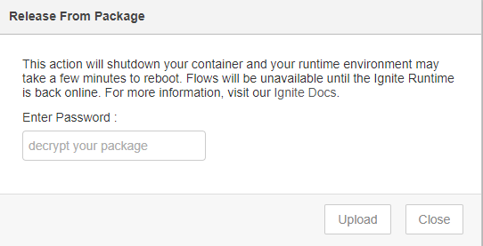

## About

This is the feature to download the complete flow from one editor and upload the same into another editor without <b>loss of any credential issue</b>.

## Download Package

Click on dropdown option from the Deploy button, you will get the option to Download Package

## Upload Package

Click on dropdown option from the Deploy button, you will get the option to Download Package

## Example

Below is the step to download and upload packages

